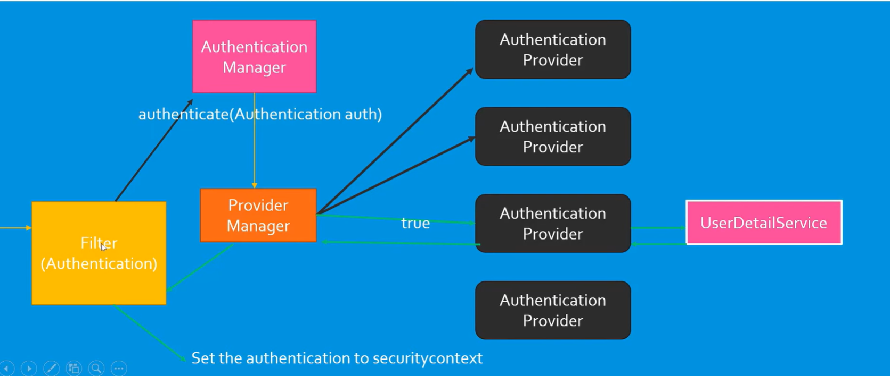

# Lazy vs Eager Fetching

## Comparison Table

| **Aspect**             | **Lazy Fetching**                               | **Eager Fetching**                              |
|------------------------|-------------------------------------------------|-------------------------------------------------|
| **Load Time**          | Related entities are loaded when accessed.      | Related entities are loaded immediately.        |
| **Performance**        | Better for performance if related entities are not accessed. | Can reduce performance if many related entities are loaded. |
| **Use Case**           | Use when you don't always need related entities. | Use when related entities are always needed.    |

---

### **Lazy Fetching**
- **Definition**: Related entities are not loaded immediately but are fetched only when explicitly accessed.
- **Performance**: Optimizes performance if related entities aren't always required.
- **Example**: `@ManyToOne(fetch = FetchType.LAZY)`.

### **Eager Fetching**
- **Definition**: Related entities are loaded immediately with the parent entity in a single query.
- **Performance**: Can negatively impact performance due to the larger volume of data loaded.
- **Example**: `@ManyToOne(fetch = FetchType.EAGER)`.

## Spring Security:

- Authentication: The identity of users are checked for providing the access to the system. validating that users are whom they are claim to be.

- Authorization: Giving user permission to access a specific resource.

- Filter: is an object that is invoked at the   and postprocessing of a request. Before sending the request to server filter will preprocess the data and if the user is valid then it will send request to server or give response to client.
    - it will send req to authentication manager -> authentication provider -> calls authenticate method -> help of user details service -> validates the user

    

# Authentication Flow in Spring Security

### 1. **Filter (Authentication)**
- A security filter intercepts all incoming requests.
- Typically handled by filters such as `BasicAuthenticationFilter` or `UsernamePasswordAuthenticationFilter` in Spring Security.
- The filter extracts credentials (e.g., username and password) from the request and creates an `Authentication` object.
- The filter calls the **Authentication Manager** to validate the credentials.

### 2. **Authentication Manager**
- Responsible for managing the authentication process.
- Delegates the actual authentication work to one or more **Authentication Providers**.
- In Spring Security configuration, Spring Boot sets up a default `AuthenticationManager` with the configured authentication providers (e.g., for in-memory, database-based, etc.).

### 3. **Provider Manager**
- A specific implementation of the `AuthenticationManager`.
- Acts as a delegator for multiple **Authentication Providers**.
- Iterates through each provider to check which one can handle the authentication request.

### 4. **Authentication Providers**
- Each `AuthenticationProvider` is responsible for authenticating specific types of credentials.
- The provider checks the supplied credentials against its configured authentication method (e.g., in-memory users, database users etc.).

### 5. **UserDetailsService**
- If the `AuthenticationProvider` requires user details, it calls the `UserDetailsService`.
- The `UserDetailsService` loads user information (username, password, roles) from a specific source (e.g., in-memory, database).

### 6. **Authentication Result**
- If the `AuthenticationProvider` successfully authenticates the user, it returns an authenticated `Authentication` object.
- The `ProviderManager` stops iterating and returns the result to the filter.

### 7. **Security Context**
- The filter sets the authenticated `Authentication` object into the **SecurityContext**.
- The `SecurityContext` is now associated with the request, enabling access to the user's authentication details for authorization decisions.

- CSRF (Cross site request forgery)

### **Concepts and Definitions**

| **Concept**           | **Definition**                                                    | **Example**                                                  |
|-----------------------|------------------------------------------------------------------|------------------------------------------------------------|
| **Authentication**    | Verifying who the user is.                                       | Logging in with a username and password.                   |
| **Authorization**     | Checking what the user is allowed to do.                        | Admins can delete books, but users can only view them.      |
| **Roles**             | Labels assigned to users for access control.                    | `USER`, `ADMIN`.                                            |
| **Filters**           | Processes each request for security checks.                     | Authentication filter, CSRF filter, etc.                   |
| **Password Encoding** | Storing encrypted passwords instead of plain text.              | `password123` → `hashed-value`.                            |
| **CSRF**              | Protection against unauthorized requests from malicious sites.  | Fake form submissions are blocked.                         |
| **SecurityFilterChain** | Defines security rules for handling requests.                  | Allowing or denying access to APIs based on roles.          |

---