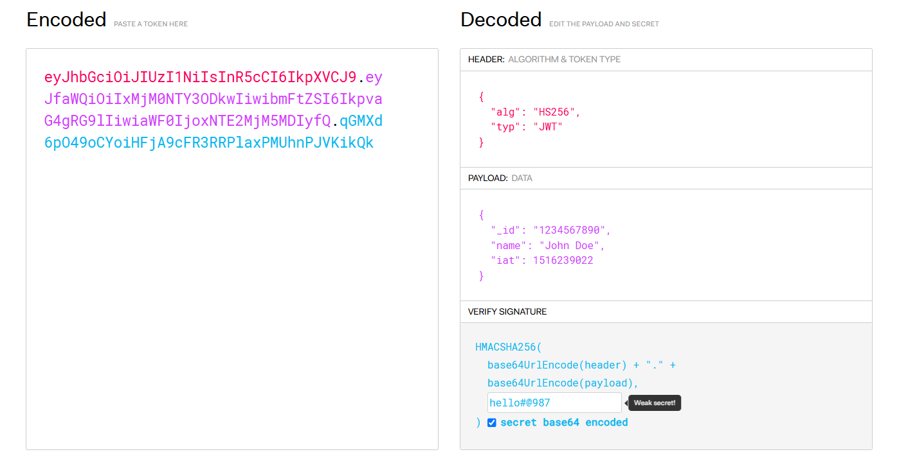
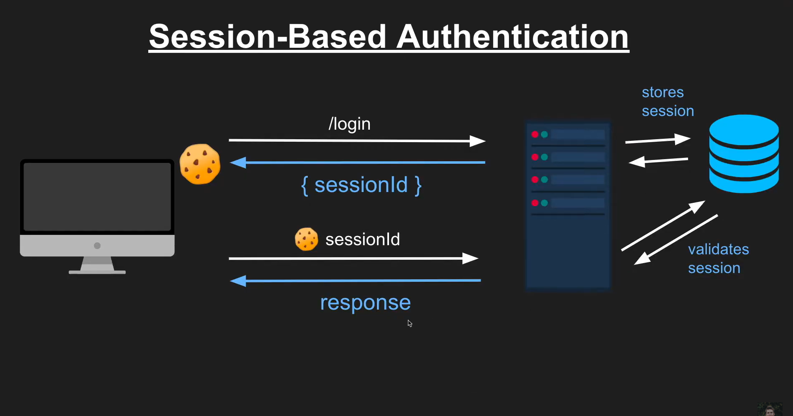
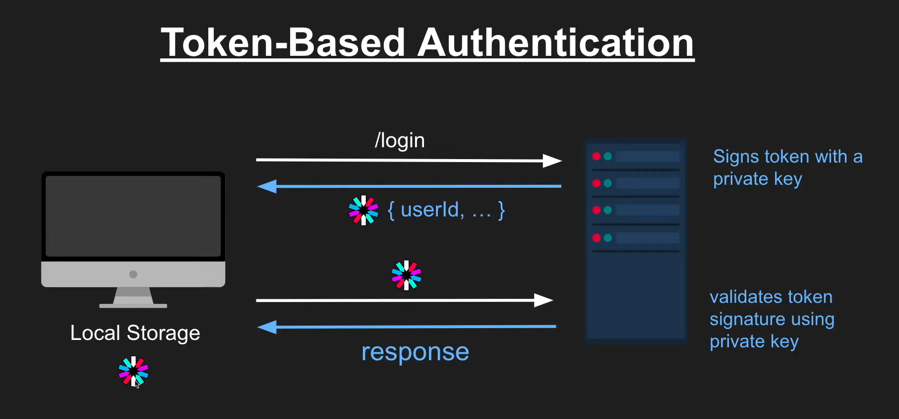

# JWT (Json Web Token):

### JWT Structure:

### Where to store JWT securely?
- In Local Storage, but JS sometimes can access it
- In session Storage
- In Cookies
- But it's better to expire JWT after few minutes and then if new request arrives regenerate it is most secure

### Session vs JWT:

### How JWT Works
Authentication Flo34w:

- Login: A user authenticates (e.g., username/password).
- Token Issuance: Server generates a JWT containing
user claims and signs it.
- Client Stores Token: Token is stored (e.g., Local Storage, Cookies).
- Request Authentication: On subsequent requests, the client sends the token (usually in the Authorization header as a Bearer token).
- Server Validates: Server verifies the signature and checks claims (e.g., expiration).