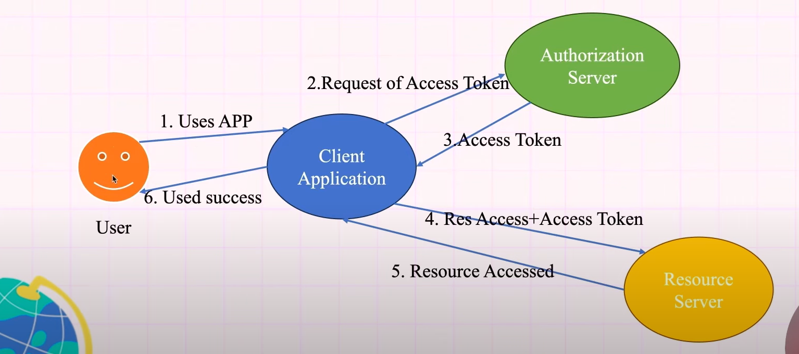

## OAuth2:

- OAuth 2.0 is an authorization framework that allows applications to access a user's resources (like data or services) on another system securely without sharing the user's credentials. It issues tokens to grant temporary access to resources.

### Flow: 

- Resource Owner:
    - The user who owns the data.
    - Example: You, the user, who wants to share your Google Drive data.

- Client:
    - The application requesting access to the user's data.
    - Example: A photo-editing app.

- Resource Server:
    - The server hosting the protected resources.
    - Example: Google Drive's API.

- Authorization Server:
    - Issues access tokens after user authentication.
    - Example: Google's OAuth2 server