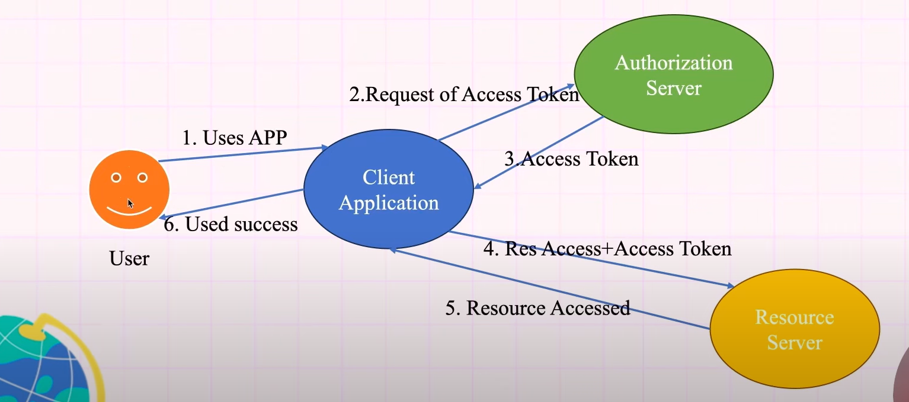

## How to store token in server-side?
- Database: Save tokens along with user info and expiration time.
- In-Memory Cache (Redis): Store tokens for faster access in high-performance apps.

## OAuth2:

- OAuth 2.0 is an authorization framework that allows applications to access a user's resources (like data or services) on another system securely without sharing the user's credentials. It issues tokens to grant temporary access to resources.

### Flow: 

- Resource Owner:
    - The user who owns the data.
    - Example: You, the user, who wants to share your Google Drive data.

- Client:
    - The application requesting access to the user's data.
    - Example: A photo-editing app.

- Resource Server:
    - The server hosting the protected resources.
    - Example: Google Drive's API.

- Authorization Server:
    - Issues access tokens after user authentication.
    - Example: Google's OAuth2 server

## OAuth 2.0 Grant Types

### 1. Authorization Code

**Purpose**: Designed for server-side applications where sensitive data like client secrets are securely stored.

**How It Works**:
- The user is redirected to the authorization server (e.g., Google or Facebook) to log in.
- Upon successful login, the server provides an authorization code to the client (your app).
- The client sends this code to the authorization server to exchange it for an access token.

**Why It’s Secure**: The code exchange and token generation occur on the server-side, keeping the access token and client secrets safe from exposure.

---

### 2. Implicit

**Purpose**: For client-side apps like single-page applications (SPAs) written in JavaScript.

**How It Works**:
- The user logs in at the authorization server.
- Instead of an authorization code, the app directly receives the access token.

**Why It’s Simpler**: Eliminates the step of exchanging an authorization code, but at the cost of security since the token is exposed in the browser and can be intercepted.

---

### 3. Password Credentials

**Purpose**: Suitable for highly trusted apps (e.g., official apps of a company) where the user trusts the app with their credentials.

**How It Works**:
- The user provides their username and password directly to the app.
- The app sends these credentials to the authorization server to obtain an access token.

**Drawbacks**:
- Not secure for third-party or public apps because the app handles user credentials.
- Potential risk if the app is compromised.

---

### 4. Client Credentials

**Purpose**: Used for machine-to-machine communication where there is no user involved (e.g., microservices communicating with each other).

**How It Works**:
- The client (e.g., a backend service) uses its client ID and secret to authenticate directly with the authorization server.
- The server provides an access token for accessing resources.

**Advantages**: Secure and efficient for automated processes, as no user interaction is required.

