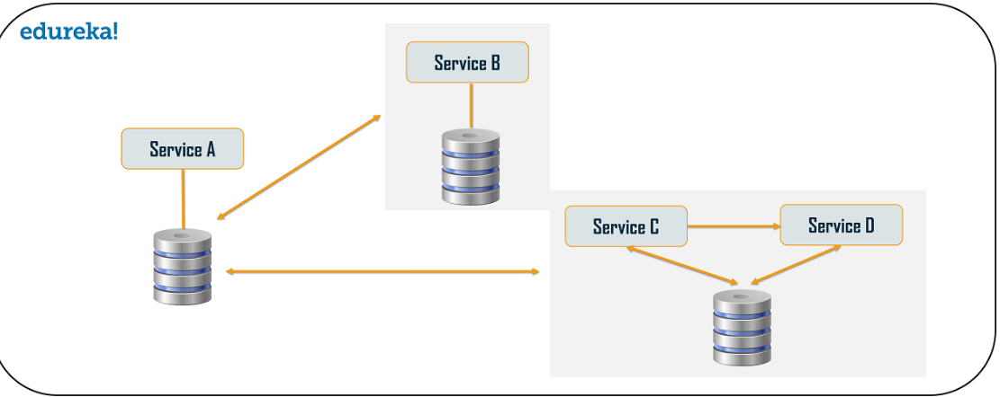

### Before Microservices (Monolithic Architecture):  
- **Structure**: All functionalities are bundled in a single codebase, tightly coupled.  
- **Development**: Teams work on the same codebase, which can lead to conflicts and slower development cycles.  
- **Deployment**: Entire application must be deployed, even for small changes, causing downtime.  
- **Scalability**: Hard to scale specific components; the entire application must scale, leading to inefficient resource usage.  
- **Technology**: Limited to a single tech stack for the whole application.  
- **Fault Tolerance**: A single failure can bring down the entire application.  
- **Testing**: End-to-end testing is complex and time-consuming.  

---

### Microservices Architecture:  
- **Structure**: Applications are divided into independent, loosely coupled services focusing on specific business capabilities.  
- **Development**: Teams work independently on services, leading to faster development and deployment cycles.  
- **Deployment**: Individual services can be deployed without affecting others, reducing downtime.  
- **Scalability**: Services can be scaled independently based on demand, optimizing resource usage.  
- **Technology**: Services can use different tech stacks suited for their functionality.  
- **Fault Tolerance**: Failure of one service doesn't affect the entire application, improving reliability.  
- **Testing**: Services can be tested individually, simplifying unit and integration testing.  
- **Communication**: Services communicate via APIs (e.g., REST, gRPC), adding flexibility.   

## Microservice Design Patterns

### 1. **Aggregator**
- **What it does:** Combines results from multiple microservices into one response for the client.
- **Why use it:** Simplifies client interactions by providing a single response.
- **Example:** A shopping app combines product details from one service, pricing from another, and reviews from another.

---

### 2. **API Gateway**
- **What it does:** Serves as a single entry point for all client requests and routes them to appropriate microservices.
- **Why use it:** Handles authentication, request routing, and response aggregation.
- **Example:** A mobile app sends requests like login, product search, and checkout to one gateway, which forwards them to the right services.

---

### 3. **Chained or Chain of Responsibility**
- **What it does:** Routes a request through a sequence of services where each service processes the request and forwards it.
- **Why use it:** Useful when data needs to be processed step by step by multiple services.
- **Example:** A loan application goes through "Validation," "Credit Check," and "Approval" services in sequence.

---

### 4. **Asynchronous Messaging**
- **What it does:** Uses message queues to enable services to communicate without waiting for immediate responses.
- **Why use it:** Improves performance and allows services to work independently.
- **Example:** A "Payment" service sends a message to a "Notification" service to send a payment confirmation email.

---

### 5. **Database or Shared Data**
- **What it does:** Services share data either by accessing the same database or synchronizing data across databases.
- **Why use it:** Ensures consistency and availability of data.
- **Example:** A "User" service and "Orders" service share a database for user data.

---

### 6. **Event Sourcing**
- **What it does:** Tracks all changes as events rather than updating the database directly.
- **Why use it:** Provides a complete history of changes and allows replays for debugging.
- **Example:** An "Order" service records events like "Order Created," "Order Confirmed," and "Order Shipped."

---

### 7. **Branch**
- **What it does:** Routes a request to multiple services in parallel, and each branch processes it independently.
- **Why use it:** Handles complex workflows that depend on the outputs of different services.
- **Example:** A travel booking request branches out to book flights, hotels, and cars simultaneously.

---

### 8. **Command Query Responsibility Segregator (CQRS)**
- **What it does:** Separates the write (command) and read (query) operations into different models.
- **Why use it:** Optimizes performance by using specialized models for reading and writing.
- **Example:** A reporting system uses a read-optimized database, while updates go to a separate write-optimized database.

---

### 9. **Circuit Breaker**
- **What it does:** Stops calls to a failing service to prevent system overload.
- **Why use it:** Increases system resilience by avoiding cascading failures.
- **Example:** If the "Payment" service is down, the circuit breaker stops further calls and returns an error.

